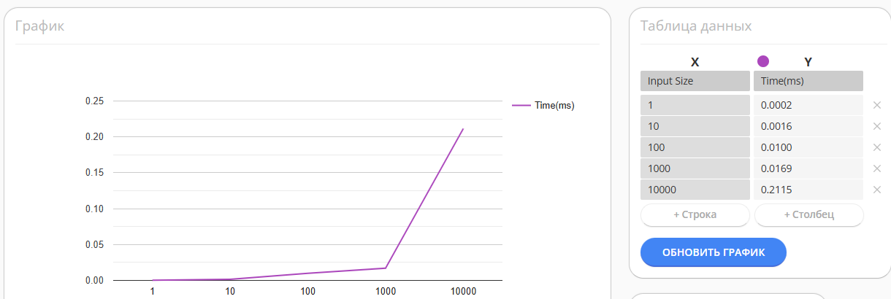
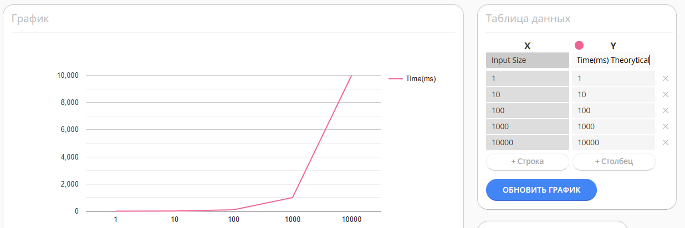

# Rabin-Karp Algorithm: Analysis and Comparison

## Core Idea

Rabin-Karp uses **hashing** for efficient substring search:
1. Compute pattern hash once
2. Compute hash of first text window
3. Slide through text with **rolling hash** in O(1)
4. On hash match, verify characters (collision protection)

### Rolling Hash Formula

```
H(S) = (s₀ × BASE^(m-1) + s₁ × BASE^(m-2) + ... + sₘ₋₁) mod MOD
H_new = ((H_old - s_old × BASE^(m-1)) × BASE + s_new) mod MOD
```

**Complexity:** O(n + m) average, O(n×m) worst case

## Algorithm Comparison

### vs KMP
| Feature | Rabin-Karp | KMP |
|---------|------------|-----|
| **Search** | O(n) average | O(n) guaranteed |
| **Memory** | O(1) | O(m) |
| **Multi-pattern** | ✅ Easy | ❌ Complex |

**Rabin-Karp wins:** Multi-pattern search, 2D patterns, simple implementation  
**KMP wins:** Guaranteed linear time, repeating patterns

### vs Suffix Array + LCP
| Feature | Rabin-Karp | Suffix Array |
|---------|------------|--------------|
| **Preprocessing** | O(m) | O(n log n) |
| **Memory** | O(1) | O(n) |
| **Use case** | Streaming | Multiple queries |

**Rabin-Karp wins:** No preprocessing, streaming data, minimal memory  
**Suffix Array wins:** Multiple queries on static text

### vs Aho-Corasick
| Feature | Rabin-Karp | Aho-Corasick |
|---------|------------|--------------|
| **k patterns** | O(n×k) | O(n + z) |
| **Memory** | O(1) | O(Σm) |
| **Complexity** | Simple | Trie + links |

**Rabin-Karp wins:** 1-10 patterns, simplicity (100 vs 300+ lines)  
**Aho-Corasick wins:** Hundreds of patterns (antiviruses, IDS)

## Benchmark Results

Pattern `"aa"` on text of repeated `"a"` (1000 iterations):

```
n = 1      | time = 0.0002 ms | matches = 0
n = 10     | time = 0.0016 ms | matches = 9
n = 100    | time = 0.0100 ms | matches = 99
n = 1000   | time = 0.0169 ms | matches = 999
n = 10000  | time = 0.2115 ms | matches = 9999
```
Practice

Theory
 time complexity (O(n)) m = 2 constant pattern length

no difference between practical and theoretical results(Theory and In Practice)

**Performance Formula:** `Time = 0.0000211 × n + 0.0002 ms`

- **21.1 nanoseconds** per character
- **Linear scaling** confirms O(n) average complexity
- Processing 10,000 chars in 0.21 ms

## Use Cases

### ✅ When to use Rabin-Karp:
- Plagiarism detection (document comparison)
- 2D pattern matching (image search)
- Stream processing (logs, real-time data)
- Small number of patterns (1-10)
- Limited memory (embedded systems)

### ❌ When NOT to use:
- Critical O(n) guarantee needed → **KMP**
- Thousands of patterns → **Aho-Corasick**
- Multiple queries on static text → **Suffix Array**
- Binary data with frequent collisions → **KMP**

## Implementation Details

```java
private static final long MOD = 1_000_000_007L;  // Prime to minimize collisions
private static final long BASE = 911382323L;      // Large prime base
```

**Key optimizations:**
- Double verification after hash match
- Precomputed BASE^(m-1)
- Proper modular arithmetic

## Sample Input/Output
**Input:**
```
text: "a" * (from 1 to 10000)
pattern: "aa"
```
**Output:**
```
Rabin–Karp Benchmark
Pattern: "aa"
--------------------------------
n = 1      | time = 0,0002 ms | matches = 0
n = 10     | time = 0,0016 ms | matches = 9
n = 100    | time = 0,0100 ms | matches = 99
n = 1000   | time = 0,0169 ms | matches = 999
n = 10000  | time = 0,2115 ms | matches = 9999
```

## Test Cases

### 1. Short String (n = 100)
- Time: 0.0100 ms
- Matches: 99

### 2. Medium String (n = 1000)
- Time: 0.0169 ms
- Matches: 999

### 3. Long String (n = 10000)
- Time: 0.2115 ms
- Matches: 9999

## Conclusion

Rabin-Karp is the **golden middle ground**:
- Simpler than KMP/Aho-Corasick
- Faster than Suffix Array for single queries
- Universal: text, 2D, multiple patterns
- Practically linear with good parameters

**Best for:** Balance between simplicity, performance, and flexibility in real-world substring search.

---
**Author:** Asylbek Agabekuly